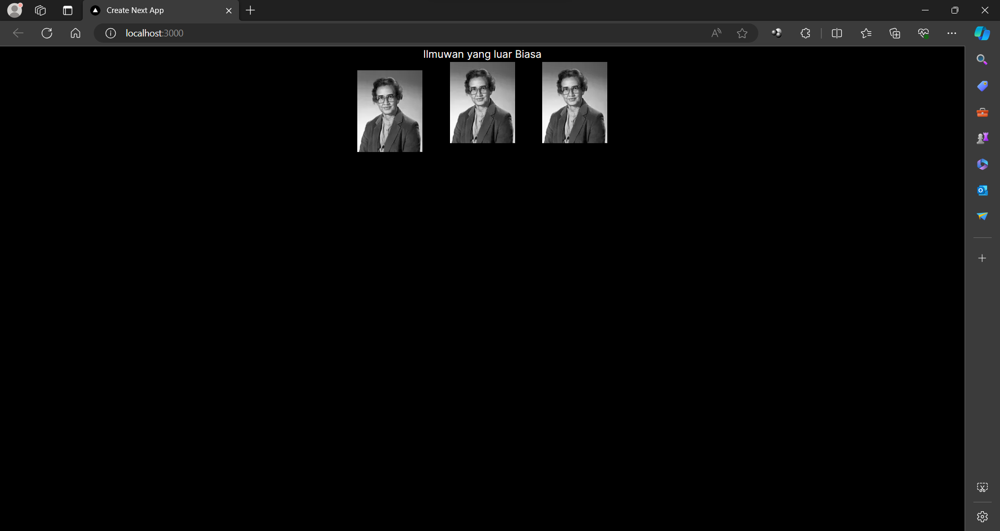

This is a [Next.js](https://nextjs.org/) project bootstrapped with [`create-next-app`](https://github.com/vercel/next.js/tree/canary/packages/create-next-app).

## Getting Started

First, run the development server:

```bash
npm run dev
# or
yarn dev
# or
pnpm dev
# or
bun dev
```

Open [http://localhost:3000](http://localhost:3000) with your browser to see the result.

You can start editing the page by modifying `app/page.tsx`. The page auto-updates as you edit the file.

This project uses [`next/font`](https://nextjs.org/docs/basic-features/font-optimization) to automatically optimize and load Inter, a custom Google Font.

## Soal 1
Ubah isi kode Home() sehingga dapat tampil seperti berikut dengan memanfaatkan komponen Profile() yang tadi sudah dibuat dari langkah 1 tersebut!


Capture hasilnya dan buatlah laporan di README.md. Jelaskan apa yang telah Anda pelajari dan bagaimana Anda solve error tersebut?

Jangan lupa push dengan pesan commit: "W03: Jawaban soal 1".

Catatan:

Jika terjadi error, Anda dapat mengakses tautan ini sebagai petunjuk solusinya: https://nextjs.org/docs/app/building-your-application/optimizing/images#remote-images




## Soal 2

Langkah 1: Buat Komponen Baru
Buatlah file baru di src/components/gallery.tsx berisi kode seperti berikut:


Langkah 2: Impor Komponen
Lakukan impor komponen di src/app/page.tsx seperti berikut ini. Hapus kode komponen lama Profile, lalu sesuaikan dengan komponen baru Gallery yang telah dibuat.


~Import the Profile component from the ./profile.tsx file.
Has a Gallery function that returns JSX elements.
The JSX element contains a div with class columns-3 which contains three Profile components.
Removed Profile's old component code.
Imported a new component Gallery from "@/components/gallery".
Replace the Profile component with Gallery.
By following the steps above, I've learned how to create and use new components in Next.js. I've have also learned how to style HTML elements with className and columns-3.


## Soal 3
Silakan perbaiki kode JSX berikut ini. Anda boleh menggunakan konverter atau perbaiki secara manual.

Capture hasilnya dan buatlah laporan di README.md. Jelaskan apa yang telah Anda pelajari dan mengapa error itu bisa terjadi?

Jangan lupa push dengan pesan commit: "W03: Jawaban soal 3".


~h1 and p tags are not closed properly: The h1 and p tags are missing closing /h1 and /p tags. This causes parsing errors in JSX.
By learning how to improve JSX code, you can improve your ability to write ReactJS code. Make sure to always follow JSX syntax correctly and study various online resources to improve your knowledge.

## Soal 4


~Kode di atas masih terdapat error, silakan diperbaiki.


# Soal 5 

Buka file src/components/todolist.tsx lakukan ekstrak URL gambar ke dalam objek person.

Capture hasilnya dan buatlah laporan di README.md. Apakah ada perbedaan pada tampilan web saat ini?


## Soal 6
Perbaiki kode tersebut pada bagian atribut src. Kode lainnya dapat Anda sesuaikan dari jawaban soal sebelumnya. Capture hasilnya dan buatlah laporan di README.md. Jelaskan apa yang telah Anda pelajari dan bagaimana tampilannya saat ini?

Jangan lupa push dengan pesan commit: "W03: Jawaban soal 6".

Catatan:

Untuk memeriksa apakah perbaikan Anda berhasil, coba ubah nilai dari imageSize menjadi 'b'. Gambar harus menyesuaikan ukuran setelah diubah.